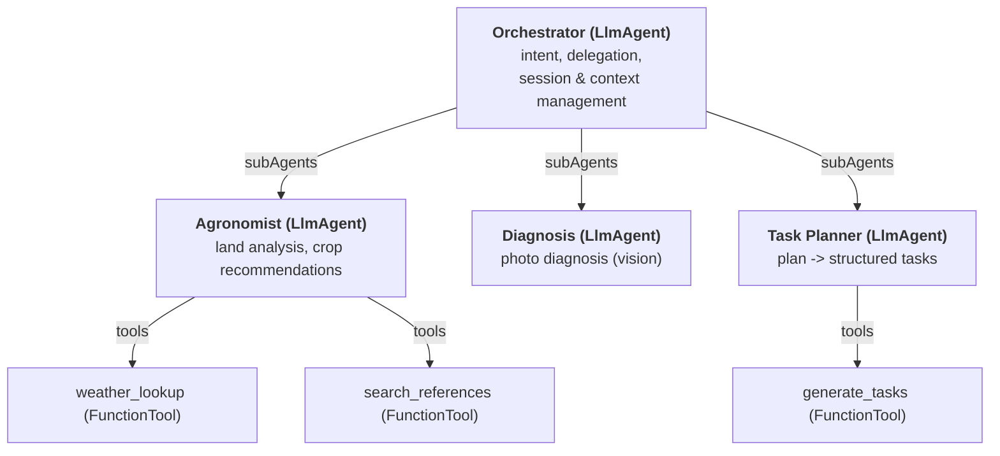
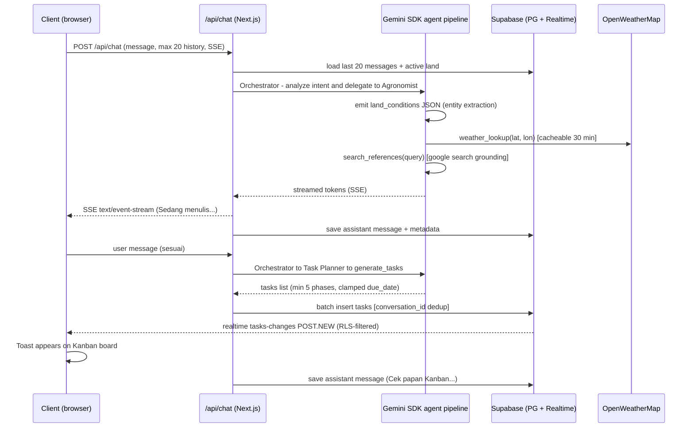
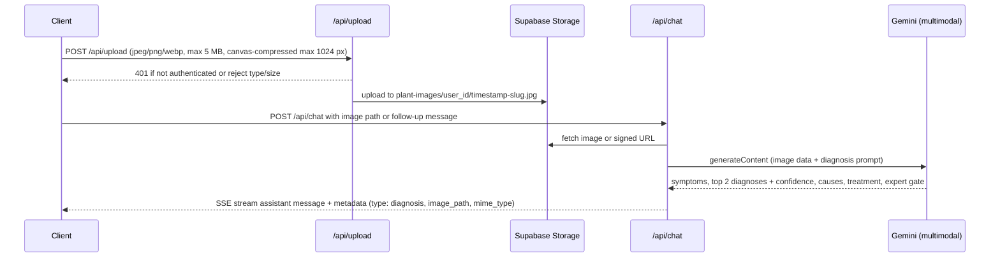
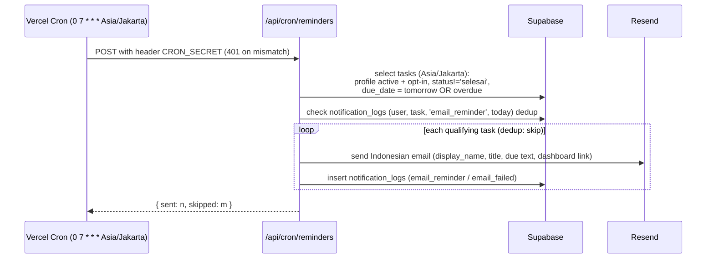

# ARCHITECTURE — Tanduri System Design

## 1. Overview

Tanduri is a fullstack serverless web application: an interactive AI Agent agriculture platform (Personal Planting Assistant) that turns a beginner gardener's spoken micro-conditions into precise crop recommendations, then into trackable daily tasks on a realtime Kanban board.

| Layer | Technology |
|-------|------------|
| Frontend + API | Next.js 15 (App Router), server components + server actions + API routes |
| Hosting | Vercel free tier |
| Backend-as-a-Service | Supabase (Postgres + Auth + Storage + Realtime) |
| AI | Gemini 2.5 Flash via `@google/genai` JS SDK (streaming + multimodal + function calling) |
| Weather | OpenWeatherMap (current weather + 5-day forecast) |
| Email | Resend API |

**Single deployment (ADR-01).** The Google ADK multi-agent pattern (Orchestrator → Sub-Agents → Tools) is implemented inside the Next.js API routes using the Gemini SDK JS function-calling features — it is **not** a separate Python service. Next.js runs server-side only; no secrets reach the browser (PRD §8, F-01 AC-10).

Key architectural properties (PRD §7):

| NFR | How it is met |
|-----|---------------|
| NFR-01 Performance | Streaming SSE, Gemini Flash (~3–6 s), clamped context window |
| NFR-02 Availability | Serverless hosting; no manual server management |
| NFR-03 Scalability | Stateless server; all state in Supabase |
| NFR-04 Security | HTTPS everywhere; env-var credentials; RLS on all tables |
| NFR-06 Reliability | Supabase = single source of truth; Realtime sync |
| NFR-07 Maintainability | Orchestrator + Sub-Agent separation |
| NFR-08 Portability | Tools decoupled from the agent core (separate module) |
| NFR-09 Cost | Free tiers only (Vercel, Supabase, OpenWeatherMap, Gemini, Resend) |

## 2. Architecture Diagram

```mermaid
flowchart LR
    Client[Browser<br/>/dashboard /chat /riwayat /lahan /profil]

    subgraph Next[Next.js App on Vercel]
        SC[Server Components<br/>+ Middleware SSR session]
        API[API Routes<br/>/api/chat, /api/upload, /api/tasks/*, /api/lands, /api/profil, /api/cron/reminders]
    end

    subgraph Supabase[Supabase]
        Auth[Auth<br/>email/password + Google OAuth]
        PG[(Postgres<br/>+ RLS)]
        ST[Storage<br/>plant-images, avatars]
        RT[Realtime]
    end

    subgraph LLM[Gemini 2.5 Flash<br/>@google/adk + @google/genai]
        AGENT[OrchestratorAgent + AgronomistAgent + TaskPlannerAgent<br/>(LlmAgent instances)]
        TOOLS[FunctionTools:<br/>weather_lookup,<br/>search_references,<br/>generate_tasks]
    end

    OWM[OpenWeatherMap]
    RS[Resend Email]

    Client -->|SSE stream| API
    Client -->|images| API
    API -->|reads/writes, service role| PG
    API -->|message/upload| Auth
    API -->|object upload| ST
    API -->|chat, function calls| LLM
    LLM --> TOOLS
    TOOLS -->|weather_lookup: fetch| OWM
    TOOLS -->|search_references: google_search grounding| LLM
    PG -->|realtime changes| RT
    RT -->|ws / tasks-changes channel| Client
    V --F Vercel Cron 0 7 * * * (Asia/Jakarta) + CRON_SECRET--> API
    API -->|email_reminder| IM
```

Notes on the diagram:
- The client talks to the Next.js API for every write and to Supabase directly (with the anon key + RLS) for reads.
- Realtime propagates task INSERT/UPDATE/DELETE from PostgreSQL to open dashboards; no polling in the happy path.
- Vercel Cron invokes `/api/cron/reminders` once per day; it authenticates via the `CRON_SECRET` header, not a user session.

## 3. Agent Architecture (ADK pattern)

ADR-001: implement the Google Agent Development Kit multi-agent hierarchy inside the API routes — `@google/adk` agent definitions (`LlmAgent` + `FunctionTool`) bridged to `@google/genai` execution via a serverless adapter (`src/lib/agents/core/runner.ts`). No separate orchestrator service.

### 3.1 Hierarchy



- **Orchestrator (root, LlmAgent):** analyzes intent, decides whether the turn belongs to Agronomist (advice/recommendation), Diagnosis (photo), or Task Planner (confirm plan → tasks), and manages session/context. Simple questions are answered inline; tool-requiring intents are delegated via `subAgents`.
- **Agronomist (sub-agent, LlmAgent):** land analysis and crop recommendation. Calls `weather_lookup` and `search_references`.
- **Diagnosis (sub-agent, LlmAgent):** photo diagnosis — a dedicated agent (previously handled inline by the Agronomist). Runs a single Gemini multimodal call (image data part + diagnosis system prompt); no separate vision model, and no tools. Image data is reused from storage on follow-ups, never re-uploaded (F-04).
- **Task Planner (sub-agent, LlmAgent):** converts a confirmed plan into tasks via `generate_tasks`.
- Edges follow the ADK convention: Orchestrator connects to sub-agents via `subAgents`; each agent wires its tools via `tools`.

### 3.2 Implementation

Every agent is an `@google/adk` `LlmAgent`: a system prompt (Indonesian-friendly, given the UI language) plus a `tools: FunctionTool[]` array. A `FunctionTool` wraps a name, description, Zod input schema, and executor; the ADK function-calling loop binds the model to declared tools and dispatches calls to the executors.

**Serverless adapter (`src/lib/agents/core/runner.ts`).** `@google/adk`'s `InMemoryRunner` keeps session state in memory, which does not persist across Vercel serverless requests. A thin adapter bridges ADK agent definitions with `@google/genai` execution: it maps each LlmAgent's system prompt and FunctionTool schemas onto the Gemini SDK function-calling surface, runs the turn server-side, and streams the result. Session/context is still rebuilt per request from Supabase (§3.4), so the server stays stateless (NFR-03).

- `weather_lookup` → OpenWeatherMap current weather + 5-day forecast by lat/lon; server fetches via `OPENWEATHER_API_KEY`.
- `search_references` → Gemini `google_search` grounding (no extra key); sources appended to the recommendation.
- `generate_tasks` → returns a JSON array of tasks for the confirmed plan.

**JSON output contract — land conditions** (emitted by the Agronomist before any tool call; extracted entities are used to decide tool usage):

```json
{
  "area_m2": 12,
  "location": "Semarang",
  "latitude": -6.9667,
  "longitude": 110.4167,
  "media": "soil",
  "water": "plenty",
  "sunlight": "full",
  "budget_idr": 500000,
  "experience": "beginner"
}
```

> YAGNI (F-03 §Notes): client code only handles `location`, `latitude`/`longitude`, `area_m2`; nothing else is stored outside the model's own context.

**JSON output contract — tasks (F-05 §4):**

```json
[
  {
    "title": "Olah lahan",
    "description": "Gemburkan tanah…",
    "due_date": "2026-08-08",
    "phase": "olah_lahan",
    "position": 1
  }
]
```

- Each generated plan must contain ≥ 5 tasks (F-05 AC-4).
- Phases follow the mandatory agronomy sequence: `olah_lahan → semai → tanam → penyiraman → pemupukan → perawatan → panen` (F-05 AC-5).
- `due_date` never in the past — clamped to today (Asia/Jakarta) (F-05 AC-7).
- Generation is idempotent per conversation: if tasks already exist, existing tasks are returned and no duplicate insert happens (F-05 AC-8).

### 3.3 Tool registry (NFR-08 portability)

Tools live in `src/lib/agents/tools/` as `FunctionTool` instances with Zod input schemas (`weather_lookup.ts`, `search_references.ts`, `generate_tasks.ts`). Each exports its FunctionTool (name + description + Zod schema + executor). Agents register tools directly on the agent via the `agent.tools` array — unified registration, no registry indirection. Adding a tool = adding one file + one entry in the owning agent's `tools` array; the agents and runner remain unchanged.

### 3.4 Session & context

- The server is **stateless** (NFR-03). Context is rebuilt per request from the DB:
  1. conversation history — last ≤ 20 messages (F-02 §7) injected as context; older messages are summarized only if needed (F-08 §5).
  2. active land summary — one paragraph (name, location, area, media, water, sunlight, budget, experience) injected into the system prompt when a `land_id` / active land exists (F-07 AC-8).
- Statelessness makes cold-start-safe on Vercel free tier.

## 4. Request Flows (sequence diagrams in mermaid)

### 4.1 Chat → recommendation → confirm → task generation (F-02, F-03, F-05)



- Client-side board `GET /api/tasks` reads through the user's anon key with RLS; task writes happen only server-side (F-05 §5, F-06 §5).
- If `generate_tasks` is a no-op (already generated), existing tasks are returned (F-05 AC-8).
- Weather failures degrade: recommendations proceed from model knowledge with note "data cuaca tidak tersedia" (F-03 §7).

### 4.2 Photo diagnosis (F-04)



Follow-ups reference the stored `image_path`;
no re-upload required (F-04 AC-9).

### 4.3 Cron email reminder (F-09)



The run is **additive and idempotent** — it never mutates task or profile rows; re-invoking the same day yields `{ sent: 0, skipped: m }` (F-09 AC-8). A failed send is logged `email_failed` and becomes a retry candidate, never a dedup (F-09 §7).

## 5. Data Layer

Ownership: schema lives in `/supabase/migrations/*.sql`. Full DDL in `docs/DESIGN.md` §6; brief summary here (authors per feature).

| Table | Owned by | Purpose | Key columns |
|-------|----------|---------|-------------|
| `profiles` | F-01 | Per-user identity + preferences | `id=fk auth.users`, `display_name`, `avatar_url`, `notification_email_preference`, `reminder_hour` |
| `lands` | F-07 | Multi-land profiles | `user_id`, `name`, `location`, `latitude`, `longitude`, `area_m2`, `media`, `water`, `sunlight`, `budget_idr`, `experience`, `is_active` |
| `conversations` | F-02 | Chat threads | `user_id`, `land_id`, `title`, timestamps |
| `messages` | F-02 | Chat comments | `conversation_id`, `role`, `content`, `metadata jsonb` |
| `tasks` | F-05 | Kanban cards | `user_id`, `land_id`, `conversation_id`, `title`, `status`, `due_date`, `position`, `phase`, `crop` |
| `task_comments` | F-06 | notes on a task | `task_id` (cascade), `user_id`, `content` |
| `notification_logs` | F-09 | email dedup/idempotency | `user_id`, `task_id`, `type`, `sent_at` — UNIQUE `(user_id, task_id, type, sent_at)` |
| `weather_cache` | F-03 | weather fetch dedup | `lat`, `lon` (PK), `payload jsonb`, `fetched_at`, TTL 30 min |

**Invariants:**
- Single active land per user → partial unique index `(user_id) WHERE is_active` (F-07 AC-2).
- User signup auto-creates a `profiles` row via trigger `on_auth_user_created` (F-01 §4) — reliable even for OAuth signup.
- Messages.metadata holds `{type:"recommendation",crops}`, `{type:"plan_confirmed"}`, `{type:"diagnosis", image_path, mime_type}` (F-03, F-04).
- Task position invariant: unique per `(user_id, land scope, status)`, ordered `status, position`; renumber via RPC `update_task_positions` atomically (F-06 §5).

### RLS policy summary

| Table | Policy | Role |
|-------|--------|------|
| `profiles` | select/update own (`auth.uid() = id`) | authenticated |
| `lands` | select/insert/update/delete own (`auth.uid() = user_id`) | authenticated |
| `conversations` | select/insert own | authenticated |
| `messages` | select/insert own | authenticated |
| `tasks` | select/update/delete own | authenticated |
| `task_comments` | select/insert/delete own | authenticated |
| `notification_logs` | service-role only (no anon access) | service role |
| `weather_cache` | service-role write | service role |

Server-side writes use the service role key and bypass RLS deliberately; the app never performs direct writes with the anon key (except where RLS is intended). Cron and email jobs are service-role only.

### Realtime

- **Table:** `tasks`, channel `tasks-changes` (public channel, RLS-filtered `user_id = auth.uid()`).
- **Events:** INSERT/UPDATE/DELETE surface to the board within ~3 seconds (F-06 AC5), fallback polling every 30 s when the connection drops.
- No Realtime on chat tables — chat is served via SSE over HTTP.

### Storage buckets

| Bucket | Access | Path | Used by |
|--------|--------|------|---------|
| `plant-images` | private, owner-only | `{user_id}/{timestamp}-{slug}.jpg` | F-04 |
| `avatars` | public-read | `{user_id}/avatar.{ext}` (overwrite) | F-10 |

### Environment variables

| Var | Client-visible? | Purpose |
|-----|-----------------|---------|
| `NEXT_PUBLIC_SUPABASE_URL` | Yes (`NEXT_PUBLIC_*`) | Supabase endpoint for SSR + client |
| `NEXT_PUBLIC_SUPABASE_ANON_KEY` | Yes | public anon key, RLS-guarded reads |
| `SUPABASE_SERVICE_ROLE_KEY` | **No** | server writes, cron, storage |
| `GEMINI_API_KEY` | **No** | Gemini SDK |
| `GEMINI_MODEL` | **No** | default `gemini-2.5-flash` |
| `OPENWEATHER_API_KEY` | **No** | `weather_lookup` |
| `RESEND_API_KEY` | **No** | email delivery |
| `CRON_SECRET` | **No** | cron endpoint auth |
| `NEXT_PUBLIC_APP_URL` | Yes | confirmed absolute links in emails (dashboard URL) |

`NEXT_PUBLIC_*` vars ship to the browser; everything else is server-side only (F-01 AC-10: the client bundle must not contain `SUPABASE_SERVICE_ROLE_KEY`).

## 6. Security

- **Transport:** HTTPS everywhere (Vercel edge + Supabase).
- **Identity:** Supabase Auth sessions managed server-side via `@supabase/ssr` (middleware refresh, cookie-based). Protected routes: `/dashboard`, `/profil`, `/riwayat`, `/lahan` — unauthenticated → 302 `/login` (F-01 AC-7).
- **Data:** RLS enabled on every table; service-role key is server-only and never reaches client code.
- **API routes:** every handler checks the session before doing anything; the only sessionless entry point is the cron route, gated by `CRON_SECRET` mismatch → 401 before any query runs (F-09 AC-1).
- **Uploads:** type/size validation on both client (`image/jpeg`,`image/png`,`image/webp`, ≤2 MB avatar / ≤5 MB diagnosis) and server (F-04 §6, F-10 §6); images in a private bucket with owner-only RLS.
- **Secrets:** no secrets in the client bundle; `.*env` gitignored, `.env.example` checked-in only.
- **Prompt injection (mitigation):** user content is treated as **data**, never as instructions — agent system prompts are baked in server-side and separated from user input; tool calls are only bound to declared functions, and stored history is truncated to 20 messages to limit overrides. Deliberately light (competition build).

## 7. Performance & Reliability

| Item | Budget / behavior |
|------|-------------------|
| Gemini Flash single-turn | ~3–6 s first token stream, then incremental |
| Complex multi-tool flow (weather + search) | ≤ 15 s (also NFR-01, PRD §3) |
| SSE first token | < 1 s after accept (non-blocking) |
| `weather_cache` TTL | 30 min; a cache hit skips the HTTP call entirely |
| `history[]` | last 20 messages (small context, cheaper cost, faster) |
| Realtime | `tasks-changes` channel; 30 s polling fallback on disconnect |
| Cron | idempotent per-day dedup via `notification_logs` UNIQUE constraint — overlapping runs can't double-send |

**Free-tier budget guardrails** (NFR-09) — Tanduri's target traffic is demo-scale:

| Service | Limit |
|---------|-------|
| Gemini AI Studio (free) | RPM/quota limits; model `gemini-2.5-flash` (budget-conscious) |
| OpenWeatherMap (free) | ~1,000 req/day, cache + source, deploy carefully |
| Resend (free) | 100/day, ~3000/month strictly tracked |
| Vercel Hobby | cold starts, function duration/monthly compute, 30s default drains — SSE streams must stay under limits |
| Supabase free | 500 MB DB, 1 GB Storage, cron via Vercel not `pg_cron` |

Cold starts on an unused function are mitigated by the SSE streaming design (first token server quickly → HTML envelope then stream); no heavy/db warm-up layer needed at this scale.

## 8. Deployment & Environments

Recommended repository layout:

```
project-root/
├─ app/                  # Next.js 15 (App Router, server actions, API routes)
├─ docs/                 # PRD, DESIGN, DECISION, ARCHITECTURE, features/, TASK
├─ supabase/
│  ├─ migrations/        # 001_auth.sql … (profiles trigger, tables, indexes, RLS)
│  └─ seed.sql           # demo user + demo land + demo tasks (see §9)
└─ scripts/              # setup/verify utilities (env check, tb dump)
```

**Vercel deployment:** push to a Git repo connected to Vercel → auto-deploy preview/production per commit. `vercel.json`/`cron.json` declares the cron schedule. Custom domains are optional; default `*.vercel.app` is demo-eligible (F-01 §8).

**Supabase setup:** create a project → apply `/supabase/migrations` in order → enable Realtime on `tasks` → create buckets `plant-images` (private) and `avatars` (public-read) → enable project email/password + Google OAuth in Auth providers, Sites URL + redirected URLs.

**Setup checklist:**
1. Create Supabase project → 2. apply SQL migrations + seed → 3. enable Realtime on `tasks` → 4. create Storage buckets + policies → 5. configure Auth providers (email/password, Google) + site URLs → 6. create Vercel project, wire Git → 7. set all env vars in Vercel + local `.env.example` → 8. deploy → verify signup/login, chat, plan, Kanban, upload, cron.

## 9. Testing Strategy

| Level | Tool | Scope |
|-------|------|-------|
| Unit | Vitest | agent JSON contract parsing (malformed `land_conditions` / `tasks`), task-generation rules (phases, due-date clamp, ≥1), cron dedup logic (UNIQUE collision handling) |
| Integration | Vitest + mocked Gemini (`@google/genai` fixtures) | API routes: session gate (401), payload validation, persistence through the SDK, weather cache hit/miss |
| E2E (manual) | — | one demo script: register → chat → recommendation appears solidsair → confirm → task batch → Kanban renders → upload photo → diagnosis → check email / cron |

**Seed data** (`/supabase/seed.sql`): one `demo@tanduri.test` user, `demo` land with realistic weather/Sun values, and ~6 pre-generated `tasks` spread across the three columns (one overdue) — so the demo opens on a green Kanban + a live reminder email.

## 10. References

- `docs/PRD.md` — vision §1, goals §3, feature map §6, NFR §7, constraints §8, ADR-01 §9.
- `docs/DESIGN.md — UI/UX, user flows, §6 data model (full DDL; this doc references it).
- `docs/DECISION.md — ADR-01 ADK/Gemini, ADR-04 cron, ADR-12 timezone, ADR avatar bucket.
- `docs/features/F-01-auth.md` — sessions, trigger, RLS pattern, protected routes.
- `docs/features/F-02-chat-konsultasi.md` — `/api/chat` SSE, history window, tables.
- `docs/features/F-03-rekomendasi-komoditas.md` — `land_conditions`, `weather_cache`, tools, `plan_confirmed`.
- `docs/features/F-04-diagnosa-foto.md` — upload, bucket, multimodal prompt contract.
- `docs/features/F-05-task-generator.md` — `tasks` schema, `generate_tasks`, idempotency.
- `docs/features/F-06-kanban-dashboard.md` — Realtime channel, server actions, RPC.
- `docs/features/F-07-multi-lahan.md` — lands, invariant, chat context injection.
- `docs/features/F-08-riwayat-konsultasi.md` — `/riwayat`, index strategy, resume.
- `docs/features/F-09-email-reminder.md` — cron, `notification_logs`, Resend contract.
- `docs/features/F-10-profil-pengguna.md` — `/profil`, avatars, reminder preferences.
- PRD glossary terms reused verbatim: Lahan, Task, Kanban, ADK Pattern, Gemini SDK, RLS, Realtime.