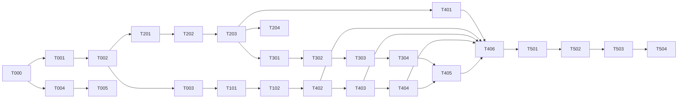

# TASK — Tanduri Build Execution Plan

## 0. How to Use This Document

- **Source of truth:** `docs/PRD.md`, `docs/DESIGN.md`, `docs/ARCHITECTURE.md`, `docs/features/F-01..F-10.md`. When a task conflicts with this file, this file wins; when this file is silent, the feature specs win.
- **Materializing a task:** copy the task block into an agent prompt. Add: "Implement T-XXX exactly as specified. Read `docs/DESIGN.md` §6 and the referenced feature spec first. Do not touch files outside the listed paths. Run the listed verification; report output."
- **Build order:** sequential by phase. Tasks inside a phase marked *parallel* have no inter-task dependency. Never start a task whose dependencies (graph in §8) are incomplete.
- **Global conventions (apply to every task):**
  - UI text Indonesian; code identifiers/comments English; docs English.
  - All deadline/reminder math in `Asia/Jakarta`.
  - Every table RLS-enabled; client reads use anon key + RLS, every write goes through server routes with `SUPABASE_SERVICE_ROLE_KEY` (never client-side).
  - Secrets only in `.env.local`/Vercel env; `SUPABASE_SERVICE_ROLE_KEY`, `GEMINI_API_KEY`, `OPENWEATHER_API_KEY`, `RESEND_API_KEY`, `CRON_SECRET` must never appear in client bundle (`NEXT_PUBLIC_` prefix only for the two Supabase vars + `NEXT_PUBLIC_APP_URL`).
  - Run `pnpm build` after each phase to catch TS errors before moving on.

### Task lifecycle & completion protocol (mandatory per task)

Every task in this file is a tracked to-do item (`- [ ]` in its block header). Each task must **fully complete** all steps before it is marked `- [x]`:

1. **Implement** the task per its spec block, touching only listed files.
2. **Run the build first, catch the error log.** Run `pnpm build` (or the command in the task's **Verification:** line) *before* considering the code done; capture the error log output. Fix build/compile errors until it passes.
3. **Type & lint gate (both mandatory, in order):**
   - `pnpm exec tsc --noEmit` — typecheck
   - `pnpm exec eslint .` — lint
   Fix every reported error; re-run until both are clean.
4. **Verify behavior** per the task's **Verification:** line (manual check or `curl`). Record what you observed.
5. **Flip the checkbox** `- [ ]` → `- [x]` **only after** steps 2–4 are green. Marking `[x]` before a passing gate is a red-flag violation.
6. **Report:** task ID, files touched, gate exit codes (tsc/eslint/build), errors caught + fixed, verification evidence, final status `[x]` or `[ ]`.

Report format when the gate fails:

```
T-XXX gate FAILED
- tsc --noEmit: exit <code> — <first error, file:line>
- eslint .: exit <code> — <rule>, <file:line>
- build: exit <code> — <first error line>
- fix applied: <what changed>
- gate re-run: PASS (all three)
```

> **Blocks:** Tasks marked `⏳ BLOCKED: menunggu design Stitch (ADR-17)` must not be started until the Stitch UI kit / design assets are available. Work the non-UI path first (see §8 dependency graph). A BLOCKED task keeps its `- [ ]` until unblocked.

## 1. Prerequisites

| Item | How to get it |
|------|---------------|
| Node.js 20+ | `node -v` (install via nvm if missing) |
| pnpm | `npm install -g pnpm` |
| Vercel account | free tier at vercel.com |
| Supabase account | free tier at supabase.com |
| Gemini API key | Google AI Studio (free tier), model `gemini-2.5-flash` |
| OpenWeatherMap API key | openweathermap.org (free, 1000 req/day) |
| Resend API key | resend.com (free tier, sandbox sender `onboarding@resend.dev` OK for demo) |

Checklist before T-000: `node -v` → `≥ v20`; `pnpm -v` → installed; all four API keys captured in a local note (pasted into `.env.local` at T-000 and Vercel at T-503).

## 2. Phase 0 — Project Scaffold & Config

### T-000: Create Next.js 15 project
- [ ] **T-000** — Create Next.js 15 project
**Files:** whole `src/` tree; `package.json`; `.env.local` (new).
**Steps:**
1. Run `pnpm create next-app tandurin-bitsmicro --typescript --tailwind --eslint --app --src-dir --import-alias "@/*"` from a parent dir (project root = this repo root).
2. Run `pnpm add @google/genai @supabase/supabase-js @supabase/ssr resend zod @dnd-kit/core @dnd-kit/sortable @dnd-kit/utilities react-markdown`.
3. Create dirs: `src/app/api/chat/`, `src/app/api/lands/`, `src/app/api/tasks/`, `src/app/api/profil/`, `src/app/api/upload/`, `src/app/api/cron/reminders/`, `src/app/api/conversations/`, `src/app/(auth)/login/`, `src/app/(auth)/register/`, `src/app/(auth)/auth/callback/`, `src/app/(protected)/dashboard/`, `src/app/(protected)/chat/`, `src/app/(protected)/riwayat/`, `src/app/(protected)/lahan/`, `src/app/(protected)/profil/`, `src/lib/agents/`, `src/lib/agents/tools/`, `src/lib/supabase/`, `src/lib/utils/`, `src/components/`, `src/types/`, `supabase/migrations/`, `scripts/`.
4. Create `.env.local` with all keys from the table in `docs/ARCHITECTURE.md` §7 as placeholders (`NEXT_PUBLIC_SUPABASE_URL=`, `NEXT_PUBLIC_SUPABASE_ANON_KEY=`, `SUPABASE_SERVICE_ROLE_KEY=`, `GEMINI_API_KEY=`, `GEMINI_MODEL=gemini-2.5-flash`, `OPENWEATHER_API_KEY=`, `RESEND_API_KEY=`, `CRON_SECRET=`, `NEXT_PUBLIC_APP_URL=http://localhost:3000`). Fill in real values when T-001 and API keys are ready. (No `.env.example` exists in `docs/` yet — T-004 creates it.)
5. Add `.env.local` to `.gitignore` (create-app default already does).
**Verification:** `pnpm dev` boots on `localhost:3000` without errors.

### T-001: Supabase project setup
- [ ] **T-001** — Supabase project setup
**Files:** `.env.local` (values filled in).
**Steps:**
1. Create free-tier Supabase project (region nearest Jakarta; record project URL + anon key + service role key).
2. Auth → Providers: enable Email/Password; enable Google OAuth and fill Client ID/Secret from a Google Cloud OAuth consent screen (Authorized redirect: `https://<project-ref>.supabase.co/auth/v1/callback`).
3. Auth → URL Configuration: Site URL = `http://localhost:3000`, add `http://localhost:3000/**` + production URL to redirect allowlist.
4. SQL Editor: `alter publication supabase_realtime add table public.tasks;`
5. Storage → Create buckets: `plant-images` (private), `avatars` (public).
6. Paste real values into `.env.local` (URL, anon key, service role).
**Verification:** in Supabase Dashboard, Realtime shows `tasks` in `supabase_realtime` publication; both buckets listed.

### T-002: Database migrations
- [ ] **T-002** — Database migrations
**Files:** `supabase/migrations/001_init.sql` (new, sole schema file).
**Steps:** Write and apply (SQL Editor) one migration containing, in order:
1. `profiles`, `lands`, `conversations`, `messages`, `tasks`, `task_comments`, `notification_logs`, `weather_cache` — DDL exactly as `docs/DESIGN.md` §6 (UUID PKs, FK→`auth.users`/`profiles`, CHECK constraints, indexes: `conversations_user_updated`, `messages_conv_created`, `tasks_user_status_due`, partial unique `lands_single_active` `(user_id) where is_active`, partial unique `tasks_positions` `(user_id, land_id, status, position)`, `weather_cache` PK `(lat,lon)`, `notification_logs` UNIQUE `(user_id, task_id, type, sent_at)`).
2. Trigger `on_auth_user_created` on `auth.users` (after insert) → `insert into profiles (id, display_name) values (new.id, coalesce(new.raw_user_meta_data->>'full_name', new.email)) on conflict (id) do nothing;` (security definer, `search_path = public`).
3. `updated_at` bump trigger for `lands`, `conversations`, `tasks` (set `updated_at = now()` on update).
4. RPC for atomic reorder:
```sql
create or replace function update_task_positions(p_user uuid, p_land uuid, p_status text, p_ids uuid[])
returns void language plpgsql as $$
declare i int;
begin
  for i in 1..array_length(p_ids, 1) loop
    update tasks set position = i, updated_at = now()
    where id = p_ids[i] and user_id = p_user and land_id = p_land and status = p_status;
  end loop;
end $$;
```
5. RLS: enable on all 8 tables. On `profiles`: select/update own (`auth.uid() = id`). On `lands`, `conversations`, `tasks`, `task_comments`, `messages`: select/insert/update/delete own (`user_id = auth.uid()`). On `notification_logs` + `weather_cache`: enable RLS, **no policies** (service-role only).
6. Storage policies: `plant-images` — `insert` (authenticated, `storage.foldername(name)[1] = auth.uid()::text`), `select`/`delete` own only; `avatars` — `select` public (anon+authenticated), `insert`/`update` own (`storage.foldername(name)[1] = auth.uid()::text`).
**Verification:** register a test user via Auth (Dashboard → Authentication → Add user) → SQL: `select * from profiles;` shows one row with `display_name = <email>`; `select * from pg_policies where schemaname='public';` lists policies on all 8 tables.

### T-003: Middleware & Auth client setup
- [ ] **T-003** — Middleware & Auth client setup
**Files:** `src/middleware.ts`, `src/lib/supabase/client.ts`, `src/lib/supabase/server.ts`, `src/lib/supabase/middleware.ts`, `src/app/api/auth/logout/route.ts`, `src/app/(auth)/auth/callback/route.ts` (all new).
**Steps:**
1. Follow the official `@supabase/ssr` pattern (supabase.com/docs/guides/auth/server-side/nextjs): `middleware.ts` refreshes session and protects routes. Protected: `/dashboard`, `/chat`, `/riwayat`, `/lahan`, `/profil` → unauthenticated 302 `/login?next=<original-path>`. Public: `/login`, `/register`, `/auth/callback`, `/api/cron/reminders` (gated by `CRON_SECRET` in route, not middleware). Authenticated users visiting `/login`/`/register` → 302 `/dashboard`.
2. `client.ts`: browser `createBrowserClient`; `server.ts`: `createServerClient` from cookies (for server components); `middleware.ts`: `createServerClient` used inside middleware.
3. `logout/route.ts`: `signOut()` then redirect `/login`. `auth/callback/route.ts`: `exchangeCodeForSession`, redirect `/dashboard` (or `next` param).
**Verification:** `pnpm build` passes. Manual: visit `/dashboard` logged out → lands on `/login?next=/dashboard`.

### T-004: .env.example + setup script
- [ ] **T-004** — .env.example + setup script
**Files:** `.env.example`, `scripts/setup.sh` (new).
**Steps:**
1. `.env.example`: every var from ARCHITECTURE §7 table, each with a comment: purpose + whether `NEXT_PUBLIC_`.
2. `scripts/setup.sh`: (a) reads `.env.local`, errors on any empty non-optional var; (b) if `supabase` CLI installed, applies `supabase/migrations/001_init.sql` to the linked project, else prints manual instruction "apply via Dashboard SQL Editor"; (c) verifies buckets exist via mgmt API when `SUPABASE_ACCESS_TOKEN` present, else prints checklist. Script must be non-destructive and idempotent.
**Verification:** `bash scripts/setup.sh` with full `.env.local` exits 0.

### T-005: UI Layout & Shared Components
- [ ] **T-005** — UI Layout & Shared Components
**Files:** `src/app/layout.tsx` (edit), `src/app/globals.css` (edit), `src/components/ui/button.tsx`, `input.tsx`, `card.tsx`, `select.tsx`, `dialog.tsx`, `toast.tsx` (+ `toaster.tsx` + `use-toast.ts`), `skeleton.tsx`, `avatar.tsx`, `badge.tsx`, `src/components/header.tsx`, `src/components/land-switcher.tsx`, `src/components/markdown.tsx`, `src/lib/i18n.ts` (all new).
**Steps:**
1. `globals.css`: CSS variables exactly per DESIGN §2 (colors, radius, shadow, font stack); Tailwind theme maps tokens (`primary`, `primary-strong`, `primary-soft`, `primary-deep`, `bg`, `surface`, `earth-50`, `earth-200`, `text`, `text-muted`, `border`, `success`, `warning`, `danger`, `danger-soft`).
2. `layout.tsx`: metadata (title "Tanduri — Solusi Tani Zaman Saiki"), `<Toaster/>`, session-agnostic (session fetched per-page).
3. Primitives styled per DESIGN §4.7: Toast bottom-center stack, 4s auto-dismiss, `aria-live=polite`; Dialog focus-trapped, Esc closes; Skeleton `--earth-200` pulse.
4. `header.tsx`: sticky top header for protected pages — logo, land switcher (dropdown, active land check-marked), "Chat Tanduri" button (primary), icon links `/riwayat`, `/lahan`, `/profil`. Mobile: icon-only. `land-switcher.tsx` is a client component fetching lands via anon client (RLS).
5. `markdown.tsx`: `react-markdown` wrapper (headings, lists, bold, links, code-safe).
6. `i18n.ts`: export const string map (Indonesian UI strings; extend as tasks add strings, e.g. `STRINGS.chat.placeholder = "Tanyakan tentang lahanmu..."`).
**Verification:** `pnpm build` passes; `/dashboard` renders header skeleton with placeholders (route page added in T-304).

## 3. Phase 1 — Auth (F-01, Day 1)

### T-101: Auth pages (F-01)
- [ ] **T-101** — Auth pages (F-01)
**Files:** `src/app/(auth)/login/page.tsx`, `src/app/(auth)/register/page.tsx`, `src/app/(auth)/login/login-form.tsx`, `src/app/(auth)/register/register-form.tsx` (new).
**Steps:**
1. Login page per DESIGN §4.1: logo + tagline, "Email" + "Kata Sandi" fields, primary button "Masuk" (loading text "Memproses..."), divider "atau", secondary "Lanjutkan dengan Google" (Google G icon, opens Supabase `signInWithOAuth` popup), link "Belum punya akun? Daftar" → `/register`. On success → `/dashboard`.
2. Register page: same + optional "Nama (opsional)" (passed as `options.data.display_name`), button "Daftar", link "Sudah punya akun? Masuk" → `/login`. After signup auto-session → `/dashboard`.
3. Error mapping (exact Indonesian strings, F-01 §7): duplicate email → "Email sudah terdaftar."; wrong password → "Email atau kata sandi salah."; Google popup blocked → "Terjadi kendala saat masuk dengan Google, gunakan email dan kata sandi."; identity conflict → "Email sudah digunakan dengan metode lain. Masuk dengan metode sebelumnya."; network → "Gagal terhubung, periksa koneksi internet Anda." Inline error + toast; button disabled while submitting.
**Verification:** register → auto-login → `/dashboard`; logout → `/login`; duplicate email shows "Email sudah terdaftar."; wrong password shows "Email atau kata sandi salah."; Google OAuth round-trip works (if key configured).

### T-102: Profile trigger + API (F-01, F-10)
- [ ] **T-102** — Profile trigger + API (F-01, F-10)
**Files:** `src/app/api/profil/route.ts` (new), `src/app/api/profil/` handlers (GET+PATCH in one file).
**Steps:**
1. GET `/api/profil`: session-gate (401 without); read `profiles` row via service role; return `{ ...profile, email }` (email from `auth.admin.getUserById` or `auth.getUser`).
2. PATCH `/api/profil`: body `{ display_name?, avatar_url?, notification_email_preference?, reminder_hour? }`; validate with zod (display_name trimmed 3–60; reminder_hour int 0–23; booleans; email never accepted); 400 with Indonesian message on violation ("Nama tampilan harus 3–60 karakter", "Jam pengingat harus 0–23"); upsert row (service role) and return updated row; missing `profiles` row → create from session user defaults.
**Verification:** register fresh user → SQL `select * from profiles` shows auto-created row (trigger from T-002); `curl -H cookie` PATCH display_name → GET returns new value; PATCH `reminder_hour: 99` → 400 "Jam pengingat harus 0–23".

## 4. Phase 2 — Chat & Agent Core (F-02, F-03, Day 1–2)

### T-201: Agent tools module (F-02, F-03) — *parallel with T-202*
- [ ] **T-201** — Agent tools module (F-02, F-03)
**Files:** `src/lib/agents/tools/weather.ts`, `src/lib/agents/tools/search.ts`, `src/lib/agents/tools/task-generator.ts`, `src/lib/agents/tools/index.ts` (new).
**Steps:**
1. `weather.ts`: export `weather_declaration` (`GeminiFunctionDeclaration`, name `weather_lookup`, params `{ latitude: number, longitude: number }`) and `weather_executor(args, supabase)`: (a) check `weather_cache` for `(lat, lon)` with `fetched_at > now() - interval '30 minutes'` → return cached `payload`; (b) else fetch OpenWeatherMap current weather (`api.openweathermap.org/data/2.5/weather?lat=&lon=&units=metric&lang=id&appid=`) + 5-day forecast; (c) upsert cache `(lat, lon)`; (d) return `{ temp_c, humidity, description, forecast_5d: [...] }`; (e) fetch/parse failure → return `null` (agent must degrade gracefully, F-03 §7: proceed + note "data cuaca tidak tersedia").
2. `search.ts`: export `search_declaration` (name `search_references`, params `{ query: string }`) and `search_executor` using Gemini `google_search` grounding (call `generateContent` with a minimal tool-config `{ googleSearch: {} }` per `@google/genai` docs; return top results array of `{ title, url, snippet }`; failure → `null`).
3. `task-generator.ts`: export `generate_tasks_declaration` (name `generate_tasks`, params: `confirmed_plan` object with `{ crops: string[], planting_window: string, experience: string, land_summary?: string }`) and `generate_tasks_executor(args)` → returns JSON array, each `{ title, description, due_date (YYYY-MM-DD), phase, position }` (schema per ARCHITECTURE §3.2; ≥5 tasks; phase sequence `olah_lahan→semai→tanam→penyiraman→pemupukan→perawatan→panen`; dates clamped to `>= today` Asia/Jakarta).
4. `index.ts`: registry `TOOLS: Record<string, {declaration, execute}>` — one registration line per tool (NFR-08).
**Verification:** `pnpm build` passes. `node`-level check optional: call `weather_executor` with real key + dummy coords → non-null JSON; second call hits cache (no network error).

### T-202: Agent orchestration module (F-02, F-03) — *parallel with T-201*
- [ ] **T-202** — Agent orchestration module (F-02, F-03)
**Files:** `src/lib/agents/orchestrator.ts`, `src/lib/agents/agronomist.ts`, `src/lib/agents/task-planner.ts`, `src/lib/agents/prompts.ts` (new).
**Steps:**
1. `prompts.ts`: SYSTEM_PROMPTS — orchestrator (intent routing), agronomist, task-planner. All must instruct: respond in Indonesian; call declared tools when needed; never fabricate tool results — if a tool returns null say "data cuaca tidak tersedia" / omit sources; land_conditions JSON emitted before tool calls; follow output JSON schemas exactly.
2. `orchestrator.ts`: `runChat({ prompt, history, tools, context, onToken })` — build content array `[system, ...history (≤20 msgs), user]`, call `client.models.generateContentStream({ model: GEMINI_MODEL, contents, config: { systemInstruction, tools } })`, forward `onToken(text)` per chunk. Handles the Gemini function-calling loop: while response has `functionCall` parts → execute via registry → append function-response parts → continue streaming. Return final parts (incl. function calls) for metadata.
3. `agronomist.ts`: `runAgronomist({ prompt, history, context })` — registers `weather_lookup` + `search_references`; includes land summary paragraph in system prompt when `context.landSummary` present; returns stream + `functionCalls[]`.
4. `task-planner.ts`: `runTaskPlanner({ prompt, history, context })` — registers `generate_tasks`; returns stream + parsed `tasks` JSON from the function call.
**Verification:** `pnpm build` passes. Smoke test with real key: call `runAgronomist` with "Rekomendasikan tanaman untuk lahan 10 m² di Semarang" → tokens stream, weather tool call fires.

### T-203: Chat API route (F-02)
- [ ] **T-203** — Chat API route (F-02)
**Files:** `src/app/api/chat/route.ts` (new).
**Steps:**
1. `POST /api/chat`: body `{ conversation_id?, land_id?, message, history[] }`. Session-gate first (401). Empty/whitespace `message` → 400.
2. Resolve context: if no `conversation_id` → create `conversations` row (title = first 60 chars of message, `land_id` from body or user's active land) via service role; else verify ownership (`user_id` match, else 404). Load last 20 messages → build `history[]`; load active land (or `land_id`) → `landSummary` paragraph (name, location, area, media, water, sunlight, budget, experience); no land at all → pass flag so agronomist asks "Tambahkan lahanmu dulu di halaman Lahan, atau ceritakan kondisinya langsung" (F-07 AC-9).
3. Run `runAgronomist`; write SSE response `text/event-stream` with events: `{ type: 'token', text }` per chunk, `{ type: 'metadata', data }` (tool calls/weather/search, if any), `{ type: 'done' }`. Set headers `Cache-Control: no-cache`, `Connection: keep-alive`.
4. Persist on completion: user message (role `user`, content=message, metadata incl. `image_path` if attached) + assistant message (`content` = full text; empty response → fallback "Layanan AI sedang tidak tersedia, coba lagi nanti" persisted, F-02 AC-6). Bump conversation `updated_at`. On stream error: log server-side, send `{ type: 'error' }`, still persist fallback message.
5. Handle abort: on client disconnect (request.signal) stop the Gemini stream; user message already persisted, assistant not — acceptable.
**Verification:** logged-in browser or `curl -N -b <session-cookie>`: send "Halo" → SSE events stream; `select * from messages` shows both rows; second message with `conversation_id` appends to same conversation; unauthenticated → 401; empty message → 400.

### T-204: Chat page UI (F-02)
- [ ] **T-204** — Chat page UI (F-02)
**Files:** `src/app/(protected)/chat/page.tsx`, `src/components/chat/chat-thread.tsx`, `src/components/chat/chat-composer.tsx`, `src/components/chat/message-bubble.tsx`, `src/components/chat/recommendation-card.tsx`, `src/components/chat/diagnosis-card.tsx`, `src/components/chat/task-summary-card.tsx` (new).
**Steps:**
1. Page per DESIGN §4.3: desktop left sidebar (conversation list: title + last message preview + date, search "Cari percakapan..."); main area: header (title, land chip "Lahan: <name>", "Konsultasi Baru"), thread, composer. `/chat?conversation_id=X` loads full thread from DB first (used by T-403).
2. `chat-thread.tsx`: SSE consumption — append tokens to last assistant bubble; typing indicator "Sedang menulis..." (animated dots, respect `prefers-reduced-motion`) while streaming; render markdown via `markdown.tsx`; user bubble right (`--primary` bg, white text), assistant left (`--surface`); on `metadata.type` render card: `recommendation` (crops + "Kecocokan: X%" badges + confirmation buttons "Sesuai" / "Ubah Rencana"), `diagnosis`, `plan_confirmed`-generated `task-summary` (task list + "Buka Kanban" → `/dashboard`). Stream error → friendly message + "Coba lagi" (re-sends last message); send button disabled while streaming; failed message kept in composer.
3. `chat-composer.tsx`: textarea placeholder "Tanyakan tentang lahanmu...", image attach button (📷, canvas-compress ≤1024px/≤5MB client-side, preview thumbnail ≤200px, remove on failure), send button "Kirim".
4. Empty state: "Selamat datang di Tanduri!" + example prompt chips (exact): "Rekomendasikan tanaman untuk lahan 10 m² di Semarang", "Tanaman cabai saya layu, kenapa?", "Buatkan jadwal perawatan mingguan" — clicking sends the prompt.
5. Image attach: wire to `/api/upload` (endpoint built in T-401 — stub client call that no-ops upload until then, image_path sent in message metadata).
**Verification:** message → response streams with "Sedang menulis..."; markdown renders; example chips send prompts; conversation persists across page reload.

## 5. Phase 3 — Recommendation, Task Gen, Kanban (F-03, F-05, F-06, Day 2)

### T-301: Recommendation flow integration (F-03)
- [ ] **T-301** — Recommendation flow integration (F-03)
**Files:** `src/app/api/chat/route.ts` (edit), `src/lib/agents/prompts.ts` (edit).
**Steps:**
1. Agronomist prompt gains: extract `land_conditions` (JSON schema per ARCHITECTURE §3.2 — handle `location`, `latitude`/`longitude`, `area_m2` only; YAGNI rest); call `weather_lookup` once per (lat,lon) when location known; call `search_references` when user asks for season/market-relevant crops; output ≥2 crops each with name, "Kecocokan: X%", reasons, planting window, harvest estimate, care notes; end with exact question "Apakah rencana ini sesuai? Saya bisa buatkan jadwal perawatannya."
2. Persist assistant message with `metadata: { type: 'recommendation', crops, weather, sources? }` (F-03 AC-8 — never discarded).
3. Confirmation detection in route: when user message is a short affirmative ("sesuai", "ya", "oke", "lanjutkan") AND the previous assistant message has `metadata.type = 'recommendation'` → mark that assistant message `metadata.plan_confirmed = true` (PATCH), reply interim message "Oke, saya buatkan jadwalnya sekarang..." then delegate to T-302 logic.
**Verification:** chat "saya ingin mulai tanam sayur di balkon 10 m² di Semarang" → recommendation with ≥2 crops, weather in `metadata`; reply "sesuai" → interim message appears; `metadata.plan_confirmed` set in DB.

### T-302: Task generation integration (F-05)
- [ ] **T-302** — Task generation integration (F-05)
**Files:** `src/app/api/chat/route.ts` (edit), `src/lib/agents/task-planner.ts` (edit, if needed).
**Steps:**
1. On confirmed plan: idempotency check — `select id from tasks where conversation_id = X limit 1`; rows exist → skip generation, use existing tasks.
2. Else run `runTaskPlanner` with confirmed plan summary (crops, planting window, experience, land summary) → parse `generate_tasks` result → validate array (≥5 items, each has title/due_date/phase; clamp past due_dates to today Asia/Jakarta) → batch insert (service role) into `tasks` with `user_id`, `land_id` (nullable), `conversation_id`, `position` from payload. Partial failure → retry once, report inserted count.
3. Post-reply: assistant message lists tasks (title + due date, Indonesian) and ends with "Cek papan Kanban di dashboard untuk mengelola jadwalmu" + `metadata: { type: 'task_summary' }`.
**Verification:** full flow per T-301 → `select count(*) from tasks where conversation_id = X` ≥5; re-confirm → no duplicate rows (idempotent); due_dates all `>= today` Asia/Jakarta.

### T-303: Kanban API (F-06)
- [ ] **T-303** — Kanban API (F-06)
**Files:** `src/app/api/tasks/route.ts`, `src/app/api/tasks/update/route.ts`, `src/app/api/tasks/[id]/comment/route.ts`, `src/app/api/tasks/[id]/route.ts` (new).
**Steps:**
1. `GET /api/tasks?land_id=&status=`: session-gate; return tasks ordered `status, position asc` (client-side Supabase read with RLS is also acceptable — pick one, document in route). 
2. `POST /api/tasks/update` body `{ id, status?, position?, description? }`: verify ownership; compute `position = max(position)+1` in target column when moving (if `position` not supplied); description edit updates only description; return updated row. 404 if task missing ("Tugas sudah dihapus").
3. `POST /api/tasks/[id]/comment` body `{ content }`: insert `task_comments` (user_id from session); return comment row. Empty content → 400.
4. `DELETE /api/tasks/[id]`: ownership check; delete (cascade removes comments + notification_logs); 404 if missing.
**Verification:** `curl` with session: update status → row changed; comment → row in `task_comments`; delete → row gone; cross-user id → 404/403.

### T-304: Kanban page UI (F-06)
- [ ] **T-304** — Kanban page UI (F-06)
**Files:** `src/app/(protected)/dashboard/page.tsx`, `src/components/kanban/board.tsx`, `src/components/kanban/column.tsx`, `src/components/kanban/task-card.tsx`, `src/components/kanban/filter-bar.tsx`, `src/components/kanban/realtime-banner.tsx` (new).
**Steps:**
1. Page per DESIGN §4.2: three fixed columns "Belum Dikerjakan" / "Sedang Dikerjakan" / "Selesai" (colored dot + title + count badge), horizontal scroll on mobile, equal grid on desktop. Header (T-005) + "Chat Tanduri" button → opens `/chat` (new tab or route).
2. Data: fetch tasks (active land default filter, client-side filtering for search + status chips "Cari tugas..."); skeleton loaders; empty column "Belum ada tugas"; zero tasks overall → CTA "Mulai Konsultasi" → `/chat`.
3. DnD with `@dnd-kit`: drop in column → optimistic move + `POST /api/tasks/update` with computed `position = max+1`; reorder within column → collect new order, call RPC `update_task_positions` (single transaction, last-write-wins); failure → revert + toast "Gagal menyimpan perubahan, coba lagi". Disabled when `navigator.onLine === false` (notice text).
4. Realtime: `supabase.channel('tasks-changes').on('postgres_changes', { event: '*', schema: 'public', table: 'tasks', filter: 'user_id=eq.<uid>' }, ...)` → merge INSERT/UPDATE/DELETE (idempotent, last-write-wins); `removeChannel` on unmount; on reconnect refetch; connection loss → amber banner "Koneksi realtime terputus, mencoba menyambung..." + 30s polling fallback.
5. Card: title, phase badge (`fase: <phase>` Indonesian label), due date; overdue (`due_date < today` && `status != selesai`) → red left border + `--danger-soft` bg + badge "Terlambat X hari" ("Terlambat 1 hari" singular); expand → description (inline edit, save via update API) + comment thread (input + list, `POST /api/tasks/[id]/comment`); "Tandai Selesai" quick action; delete → confirm dialog "Hapus tugas ini?" ("Batal"/"Hapus"). Keyboard fallback move buttons per DESIGN §9.
**Verification:** tasks from T-302 appear within ~3s on another tab (realtime); drag between columns persists + reorders; comment persists on reload; overdue card styled; delete confirms + removes.

## 6. Phase 4 — Remaining Features & Deploy (F-04, F-07, F-08, F-09, F-10, Day 2–3)

### T-401: Photo diagnosis (F-04) — *parallel*
- [ ] **T-401** — Photo diagnosis (F-04)
**Files:** `src/app/api/upload/route.ts` (new), `src/lib/agents/agronomist.ts` + `src/app/api/chat/route.ts` (edit), `src/components/chat/diagnosis-card.tsx` (edit).
**Steps:**
1. `POST /api/upload` multipart (field `image`): session-gate; validate type (`image/jpeg|png|webp`) → 400 "Format gambar tidak didukung"; size ≤5MB → 400 "Ukuran maksimal 5 MB"; upload to `plant-images` path `{user_id}/{timestamp}-{slug}.jpg` (slug from original name, sanitized); return `{ path }` (no public URL — private bucket).
2. Chat: when message carries `image_path` (or last messages in conversation have `metadata.image_path` and user asks a follow-up, F-04 AC-9): server fetches image bytes from Storage (service role), adds as inline `inlineData` part to the first user content, and instructs the agronomist with the diagnosis system prompt (F-04 §6 verbatim intent: symptoms → top-2 diagnoses + confidence tinggi/sedang/rendah → causes → step-by-step treatment for beginners → consult-expert gate, pesticides last resort → disclaimer "AI estimate, not laboratory diagnosis").
3. Persist assistant message with `metadata: { type: 'diagnosis', image_path, mime_type }`; render `diagnosis-card.tsx` (image preview + structured sections + disclaimer). Follow-ups reuse stored `image_path` — never require re-upload.
4. Error paths: blurry/empty → "Foto kurang jelas, coba foto lebih dekat dan pastikan cahaya cukup"; API failure → friendly error + retry; signed URL expiry → regenerate once server-side.
**Verification:** upload jpeg → object in `plant-images` under own user_id path; chat with image → diagnosis reply with all 5 sections + disclaimer; follow-up question in same conversation → uses image without re-upload; 6MB file → 400 "Ukuran maksimal 5 MB".

### T-402: Multi-land CRUD (F-07) — *parallel*
- [ ] **T-402** — Multi-land CRUD (F-07)
**Files:** `src/app/api/lands/route.ts`, `src/app/api/lands/[id]/route.ts`, `src/app/api/lands/active/[id]/route.ts`, `src/app/(protected)/lahan/page.tsx`, `src/components/lands/land-form.tsx`, `src/components/lands/land-card.tsx` (new).
**Steps:**
1. `GET /api/lands` (list, active first), `POST /api/lands` (create; first land auto `is_active = true`; validation per F-07 AC-4..6 with zod → 422 field-level Indonesian messages; name ≤60 required; area 1–100000; budget 0–1e12; lat/lon both-or-neither, ranges ±90/±180; enums `soil|hydroponic|pot|other`, `plenty|limited`, `full|partial|shade`, `beginner|experienced|professional`).
2. `PATCH /api/lands/[id]` (same validation), `DELETE /api/lands/[id]` — soft-block: if any task has `land_id = id` → 409 "Pindahkan atau hapus tugas lahan ini dulu"; deleting the active land → oldest remaining (`created_at`) becomes active (single transaction).
3. `PATCH /api/lands/active/[id]`: single transaction — `update lands set is_active=false where user_id=me`, then set target true (partial unique index `lands_single_active` enforces invariant; catch constraint violation → friendly error, UI refetches active land).
4. `/lahan` page per DESIGN §4.5: card grid (active card: "Aktif" badge + `--primary-soft` border; chips media/sunlight/water; area m², budget, task count), "Tambah Lahan"/"Edit Lahan" modal (fields + labels per DESIGN §4.5), "Jadikan Aktif", "Hapus" with confirm; empty state "Belum ada lahan, tambahkan lahan pertamamu" + CTA.
5. Chat + dashboard integration: `GET /api/chat` context uses active land when no `land_id` passed (T-203 already loads it — verify); dashboard filter defaults to active land (T-304).
**Verification:** create 2 lands → first is active; switch → exactly one `is_active=true` in DB; create land with `area_m2: 0` → 422; land with tasks → DELETE 409 with message; delete active land → oldest remaining active.

### T-403: Consultation history (F-08) — *parallel*
- [ ] **T-403** — Consultation history (F-08)
**Files:** `src/app/api/conversations/route.ts`, `src/app/api/conversations/[id]/route.ts`, `src/app/(protected)/riwayat/page.tsx` (new).
**Steps:**
1. `GET /api/conversations?q=`: session-gate; list `updated_at desc` with message count + last message preview (lateral join; do not fetch full threads). Client-side title filter (case-insensitive substring) on `/riwayat` search "Cari riwayat...".
2. `DELETE /api/conversations/[id]`: cascade delete conversation + messages (`messages.conversation_id` FK has `on delete cascade`); tasks survive (FK non-cascading — verify migration matches). 404 "Percakapan tidak ditemukan".
3. `/riwayat` page per DESIGN §4.4: cards (title ≤60 truncated, land name badge if linked, date Asia/Jakarta, message count, last preview), click → thread view (same markdown renderer + images + metadata badges "Rekomendasi"/"Diagnosis"), "Lanjutkan Konsultasi" → `/chat?conversation_id=X` (page preloads full thread from DB, appends new messages to same conversation, sends last 20 messages as `history[]` per T-203); trash → confirm "Hapus percakapan ini?" → optimistic removal; empty state "Belum ada riwayat konsultasi" + CTA "Mulai Konsultasi".
**Verification:** chat → visit `/riwayat` → conversation listed with preview; click → full thread; "Lanjutkan Konsultasi" → `/chat?conversation_id=…` resumes context (agent recalls prior topic); delete → gone from list, tasks on board unchanged; unauthenticated → `/login`.

### T-404: Profile page UI (F-10) — *parallel*
- [ ] **T-404** — Profile page UI (F-10)
**Files:** `src/app/(protected)/profil/page.tsx`, `src/components/profile/avatar-upload.tsx` (new).
**Steps:**
1. Page per DESIGN §4.6, three cards: "Profil" (avatar circle 96px + "Ubah Foto" — jpeg/png/webp ≤2MB, client preview before save, upload to `avatars` path `{user_id}/avatar.{ext}` via `/api/upload` variant or direct storage with service-role route; overwrite same path; display_name input; email read-only disabled + note "Email tidak dapat diubah"); "Preferensi Pengingat" (toggle "Aktifkan pengingat email" → `notification_email_preference`; select "Jam pengingat harian" 0–23, default 7); "Akun" (danger-outline "Keluar" → logout route → `/login`).
2. Save per card → `PATCH /api/profil`; success toast "Perubahan tersimpan"; validation toasts/messages exact per DESIGN §4.6 ("Nama tampilan harus 3–60 karakter", "Jam pengingat harus 0–23", "Ukuran maksimal 2 MB", "Format gambar tidak didukung", "Gagal mengunggah foto profil" — keep old avatar + still save other fields, "Gagal menyimpan, periksa koneksi internet Anda").
3. Header avatar: show `avatar_url` when present (from profile fetch).
**Verification:** edit name → persists + toast; upload avatar → replaces object at same path, new avatar displays; reminder_hour 22 → persists and returned by GET; logout → `/login`; oversized file → rejection, old avatar intact.

### T-405: Email reminder cron (F-09) — *parallel*
- [ ] **T-405** — Email reminder cron (F-09)
**Files:** `src/app/api/cron/reminders/route.ts` (new), `vercel.json` (new).
**Steps:**
1. Route: require header `CRON_SECRET === process.env.CRON_SECRET` before ANY query → else 401.
2. Selection (Asia/Jakarta): `profiles` joined `tasks` where `notification_email_preference = true`, `status != 'selesai'`, `due_date = (today + 1 day)` OR `due_date < today`.
3. Dedup: for each, check `notification_logs (user_id, task_id, 'email_reminder', today)`; exists → `skipped++`.
4. Send via Resend (server-side only): subject `🌱 Pengingat Tanduri: <title>`; body greeting with `display_name`, task title, due text "Jatuh tempo besok (12 Agustus 2026)" (Indonesian locale) or "Sudah terlambat X hari", link `NEXT_PUBLIC_APP_URL/dashboard`, signature "Tim Tanduri". From = `onboarding@resend.dev` (sandbox) or verified domain if configured.
5. Log outcome: success → `insert notification_logs (type 'email_reminder', sent_at today)`; failure → insert type `email_failed` (retry candidate, never blocks dedup), continue loop; UNIQUE conflict on insert → catch, `skipped++`.
6. Return `{ sent: n, skipped: m }`. Never mutates tasks/profiles.
7. `vercel.json` in project root: `{ "crons": [{ "path": "/api/cron/reminders", "schedule": "0 7 * * *" }] }`. Vercel sends `CRON_SECRET` as an env-var-derived header. Hobby plan supports 2 crons — verify in Vercel Dashboard after deploy. Fallback if Hobby cron unavailable: `.github/workflows/reminders.yml` (schedule `0 0 * * *` UTC, `curl -X POST ${{ secrets.CRON_URL }} -H 'x-cron-secret: ${{ secrets.CRON_SECRET }}'`).
**Verification:** seed task `due_date = tomorrow` for opted-in user → `curl -X POST <prod-or-local>/api/cron/reminders -H "x-cron-secret: <CRON_SECRET>"` → `{ sent: 1, skipped: 0 }`; re-run same day → `{ sent: 0, skipped: 1 }`; wrong secret → 401; overdue task → email says "Sudah terlambat X hari"; email arrives in sandbox inbox (if Resend sending enabled).

### T-406: E2E demo script
- [ ] **T-406** — E2E demo script
**Files:** `scripts/demo.md`, `scripts/seed.sql` (new).
**Steps:**
1. `scripts/seed.sql`: idempotent inserts — demo user `demo@tanduri.test` (fixed UUID, `crypt` password via `auth.admin` convention or documented manual step), demo land (Semarang coords, soil/plenty/full), ~6 tasks spread across the three columns with due dates `today..today+7` including one overdue (Asia/Jakarta) + matching `notification_logs` where already sent.
2. `scripts/demo.md`: step-by-step demo script — (1) register/Google login, (2) create land, (3) chat recommendation, (4) confirm → tasks appear on Kanban, (5) drag a card, (6) upload diagnosis photo, (7) run cron manually + show email, (8) show riwayat + resume, (9) profile avatar. Each step: action, expected UI state, talking points.
3. Deployment verification checklist: health (`GET /` 200), all env vars present in Vercel, cron registered in Vercel dashboard, manual cron trigger returns JSON.
**Verification:** apply `scripts/seed.sql` via SQL Editor → demo user logs in, board populated; demo script walkable start-to-finish.

## 7. Phase 5 — Polish & Deploy (Day 3)

### T-501: Error boundaries & monitoring
- [ ] **T-501** — Error boundaries & monitoring
**Files:** `src/app/error.tsx`, `src/app/not-found.tsx`, `src/app/(protected)/error.tsx`, `src/app/(auth)/error.tsx` (new).
**Steps:** per-route-group error boundaries (Indonesian fallback UI + "Coba lagi" reset button); global 404 + 500 pages; toast on API failures via shared fetch helper (`src/lib/utils/fetch.ts`: wrap `fetch` → on non-OK, toast Indonesian message, surface response body error); `console.error` on server-side failures (free tier — no external monitoring).
**Verification:** trigger 404 → styled page; force an API 500 → toast, no white screen.

### T-502: Mobile responsiveness audit
- [ ] **T-502** — Mobile responsiveness audit
**Files:** audit only (edits as needed).
**Steps:** verify DESIGN §8: `<640px` kanban columns horizontal scroll + full-width cards; chat full-height single pane, composer fixed bottom; header icon-only; forms single column; `<640–1024px` sidebar collapsible, cards 2-up; `>1024px` 3-column grid. Check focus rings (`ring-2 ring-primary-strong ring-offset-2`), `aria-label`s, `prefers-reduced-motion` on typing indicator + skeletons.
**Verification:** DevTools responsive modes 375/768/1280 px — no horizontal page overflow, all interactions work.

### T-503: Final deploy
- [ ] **T-503** — Final deploy
**Files:** `vercel.json` (create/update), `next.config.ts` (edit if needed), Vercel env vars.
**Steps:**
1. Ensure `vercel.json` exists with cron config from T-405. Add `"functions": { "api/cron/reminders/route.ts": { "maxDuration": 30 } }` if the cron needs >10s.
2. `pnpm build` → fix all TS/lint errors.
3. Push repo to GitHub, import to Vercel (or `vercel deploy --prod` if CLI authed).
4. Set all env vars in Vercel Project Settings → Environment Variables (copy from `.env.local`; replace `NEXT_PUBLIC_APP_URL` with production URL).
5. Add production URL to Supabase Auth redirect allowlist + Google OAuth authorized redirects; set Site URL.
6. Confirm cron registered (Vercel dashboard → Cron).
**Verification:** production URL loads; register → login → dashboard; all Must features live: auth, chat, recommendation, task gen, kanban, photo upload.

### T-504: Post-deployment verification
- [ ] **T-504** — Post-deployment verification
**Files:** none (checks).
**Steps:** run T-406 demo script end-to-end on production URL; Vercel Deployment logs → no unhandled errors; Supabase Logs → no RLS violations/aborted queries; confirm `SUPABASE_SERVICE_ROLE_KEY` absent from browser bundle (search "service_role" in deployed JS via DevTools Network); latency spot-check (chat reply ≤8s simple, ≤15s multi-tool).
**Verification:** checklist in `scripts/demo.md` fully green.

## 8. Task Dependency Graph



**Parallelizability notes:** T-201/T-202 run before T-101/T-102 (no dependency — only need T-002 schema). T-401, T-402, T-403, T-404, T-405 all parallel after T-203/T-304 (T-405 needs `tasks` + `profiles` + `notification_logs` only). T-005 shared components must precede T-101, T-204, T-304, T-402, T-403, T-404.

**Acceptance coverage:** F-01 → T-003/T-101/T-102; F-02 → T-201..T-204; F-03 → T-201/T-202/T-301; F-04 → T-401; F-05 → T-201/T-302; F-06 → T-303/T-304; F-07 → T-402; F-08 → T-403; F-09 → T-405; F-10 → T-102/T-404. Every AC listed in a feature spec maps to at least one step in its covering tasks; when closing a task, re-read the spec's Definition of Done and check off each line before reporting success.

## 9. Risks & Mitigations

| Risk | Mitigation |
|------|-----------|
| Gemini API key not activated / quota exhausted | `GEMINI_API_KEY` missing or 429 → route logs, replies "Layanan AI sedang tidak tersedia, coba lagi nanti" (F-02 §7). For demos without key: optional mock mode in `lib/agents/` returning canned markdown with the exact expected output shape. |
| Vercel Hobby cron unavailable (max 2 crons, daily only) | Verify at T-405; fallback: GitHub Actions scheduled workflow (`.github/workflows/reminders.yml`, schedule `0 0 * * *` UTC, curl endpoint with `x-cron-secret`) or manual trigger before demo. Document chosen path in `scripts/demo.md`. |
| Resend sandbox limits (no verified domain) | Use `onboarding@resend.dev` sender; emails go to whitelisted recipients — demo with own inbox. If sending blocked: show `notification_logs` rows as proof the pipeline ran. |
| Supabase free DB 500MB / Storage 1GB | Test data only (few images, compressed ≤1024px) — fine. Keep image retention policy: same-path avatar overwrite, no orphan uploads. |
| Browser compatibility | Target modern Chromium/Firefox/Safari only (demo scope). DnD has keyboard fallback; `navigator.onLine` gates drag. |
| Realtime channel flaky on free tier | 30s polling fallback + amber banner (T-304 step 4); board stays correct via refetch. |
| SSE timeout / cold start on Vercel | First token <1s after accept; keep Gemini stream ≤20s network timeout; abort handling in T-203 step 5. |
| `docs/DECISION.md` referenced by specs but not present in repo | TASK.md is the operative spec; ignore missing DECISION.md references. If an agent queries it, tell it to continue from DESIGN/ARCHITECTURE/feature files. |
